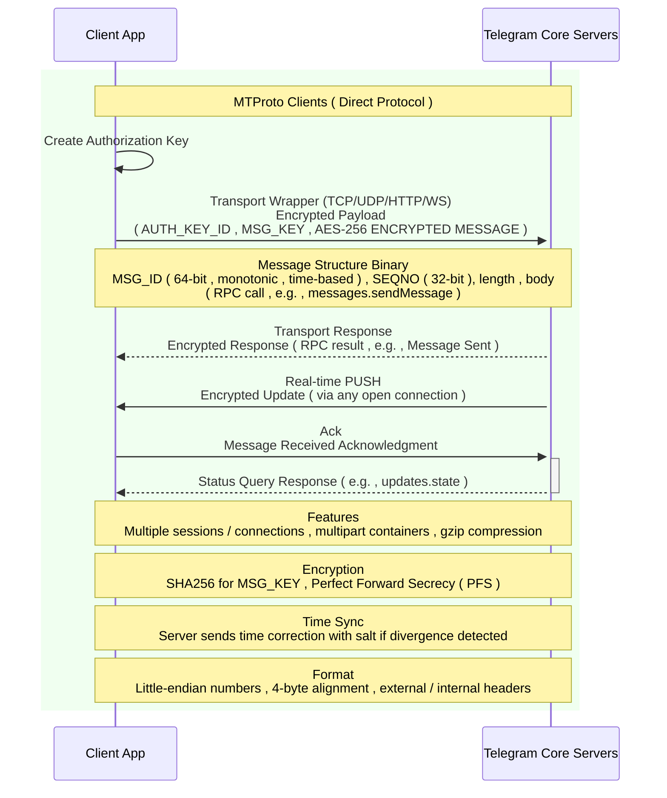
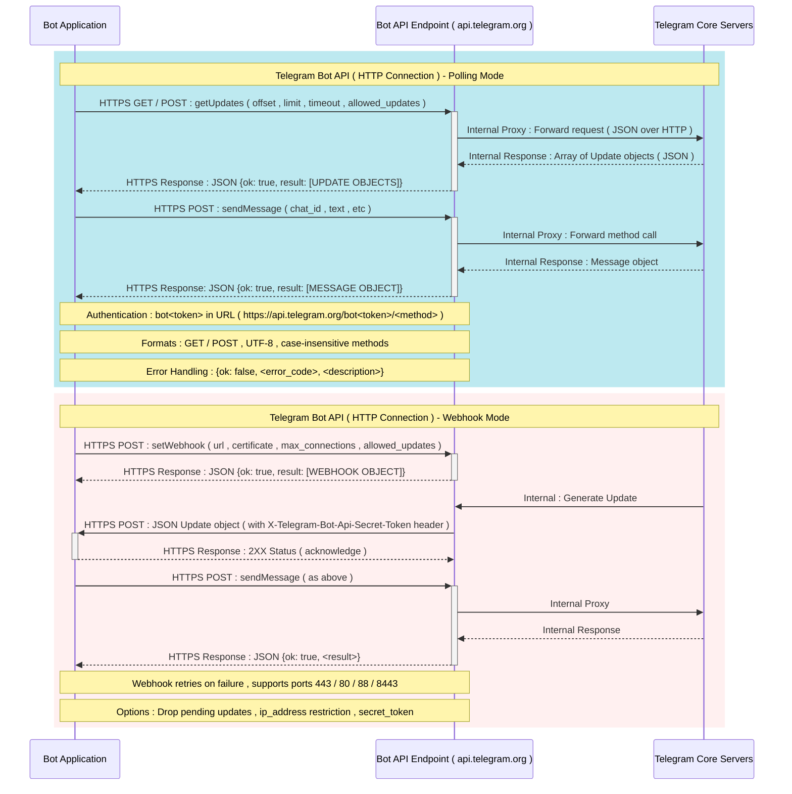

# HTTP Bot API vs MTProto

> [!TIP]
> So here we want to compare the MTProto protocol and the HTTP API of Telegram

---

## Overview diagram

> *With this overview, you can make better decisions, so pay attention to the charts below*

---

### MTProto

---

### HTTP Bot API

---

### Purpose & intended users

* **MTProto** : Designed as Telegram's native client protocol. It's the primary protocol used by official and third-party Telegram clients to act as real *users*, it supports the full feature set of Telegram. Advanced bot implementations can also use it, but that's less common
* **Bot API** : Designed specifically for bot accounts. It's an official, higher-level HTTP / JSON API that exposes bot functionality in a simple, RESTful way

### Connection model

* **MTProto** : Stateful, long-lived TCP / TLS connections with sessions, message sequencing, and push-style updates from server  client. Better for realtime, high-throughput flows
* **Bot API** : Stateless HTTP requests. Bots typically use long polling or register webhooks to receive updates ( server pushes are via webhooks only )

### Payloads & performance

* **MTProto** : Binary TL serialization, compact messages, less overhead per request, generally higher throughput and lower bandwidth usage for the same operations
* **Bot API** : JSON over HTTP, easy to read and debug but more verbose, higher per-request overhead and latency in some patterns

### Features & completeness

* **MTProto** : Access to the full Telegram protocol and features ( client-side features, some message types and lower-level operations not exposed via Bot API )
* **Bot API** : Exposes the official bot functionality only. Some lower-level or user-only features **are not available**

### Rate limits & request restrictions

* **MTProto** : Fewer artificial HTTP-style limits per request, suitable for high-rate use, bulk messaging, or file transfers ( Note : Telegram still enforces anti-abuse measures and fair use )
* **Bot API** : Has documented rate limits and practical restrictions ( especially relevant for large-scale bots ) You must design around polling / webhook constraints

### File handling and large media

* **MTProto** : Better suited for uploading / downloading very large files and for more flexible file transfer flows ( chunking, resumable parts ) used by clients
* **Bot API** : More restrictions for large files, uploads go through specific endpoints and size / throughput limits are more restrictive in practice

### Reliability & network behavior

* **MTProto** : Can be more resilient in restrictive networks because clients can connect to different data centers, use different ports, and use session-level reconnection strategies. In some cases it can continue working when specific HTTP endpoints are blocked
* **Bot API** : Simpler to host globally, dependent on HTTP endpoints and webhook delivery can be affected by network or hosting issues

### Security & encryption

* **MTProto** : Implements Telegram's protocol-level encryption and session management between client and server ( Secret chats are end-to-end, but normal cloud chats are encrypted server-side )
* **Bot API** : Uses HTTPS / TLS for transport security. Simpler security model but still secure for most bot use cases

### Complexity & developer effort

* **MTProto** : More complex to implement  binary protocol, session handling, DC management, message ID / sequence handling, re-serialization of TL objects. Fewer beginner-friendly libraries, steeper learning curve
* **Bot API** : Very easy to use, plentiful libraries, SDKs, and examples in many languages. Fast iteration and deployment, including serverless environments

### Resource usage & hosting

* **MTProto** : Requires a persistent connection and typically uses more CPU and memory on the host ( crypto, session state, and possibly higher concurrency )
* **Bot API** : Works well with stateless environments and serverless platforms ( each request is independent ), lower resource demands per request

### Observability & tooling

* **MTProto** : Harder to debug without specific tools because traffic is binary, requires protocol-aware debugging tools or libraries
* **Bot API** : Easy to test with curl, Postman, or browser-based tools, logs and requests are human-readable

### When to choose which

* **Choose MTProto if** :

  * You need full client-level features not exposed by Bot API
  * You require maximum throughput, smaller payloads, or robust file transfer for large media
  * You are building a full Telegram client, a sophisticated user-account automation, or need to operate in network conditions where the HTTP endpoints are unreliable or blocked
  * You can manage greater implementation complexity and resource needs

* **Choose Bot API ( HTTP ) if** :

  * You're building a standard bot and want the easiest, fastest path to production
  * You prefer to use existing HTTP / JSON libraries and serverless or low-maintenance hosting
  * You don't need user-only features and want the official, stable interface supported by Telegram

---

## Quick summary table

| Aspect | MTProto | Bot API HTTP |
| :---: | :--- | :--- |
| *Intended for* | Full clients ( users ), advanced bots possible | Bots ( official ) |
| *Connection* | Stateful TCP / TLS long-lived | Stateless HTTP, polling or webhooks |
| *Payload* | Compact binary ( TL ) | JSON ( verbose ) |
| *Features* | Full protocol access | Bot features only |
| *Rate limits* | Fewer per-request overheads ( but anti-abuse still applies ) | Documented limits, tighter for large uploads |
| *Complexity* | High, harder to implement | Low, easy, many SDKs |
| *Resource usage* | Higher ( crypto, sessions ) | Lower ( stateless ) |
| *Best for* | High throughput, full functionality, resilient connections | Quick bot development, serverless, simple workflows |